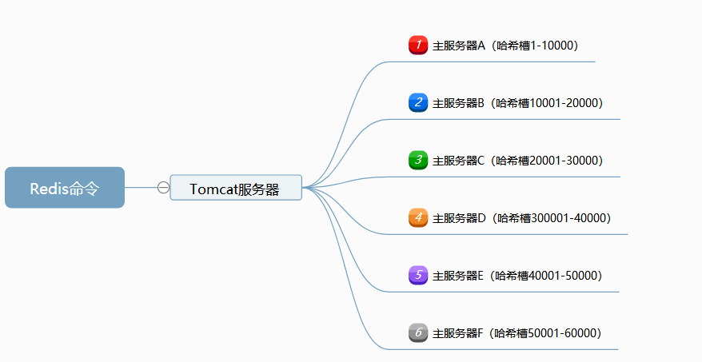

## Redis详细设计文档

### Redis环境配置

+ JDK 1.8
+ Tomcat 8.0
+ Maven

### Redis分布 式缓存结构图



### 一、Redis实现的命令选项

+ set key vlue：键值对都为字符串，键和值都只能是一个值；
+ lset key value1 value2 value3：键为字符串，值为list集合；
+ hset key value：键为字符串，值为set集合；
+ get key：返回指定key对应的缓存数据；
+ del eky：删除指定的key对应的缓存数据；
+ expire key  10：设置key的过期时间10秒，ever表示永不过期；

### 二、客户端和服务器通信实现 

​	客户端和服务器采用Socket连接通信，客户端通过服务器的IP和端口与服务器进行连接，获取连接后，检查发送的命令是否合法，命令语法正确，发送命令到服务器，等待服务器响应回复结果数据。

​	服务器监听客户端请求，获取客户端请求后开启一个线程处理客户端的命令，检查命令是否合法，合法执行该命令，将命令的执行结果的字节数据返回给客户端，结束些次响应，关闭该线程。

### 三、分布式缓存的实现

​	客户端开始启动时从远端备份服务器上加载主服务器的IP和端口信息，并且配置主服务器哈希槽长度，加载到内存当中，保持该数据到内存中，根据键的HASH值判断主服务器，提供主服务器信息。

```java

	public class HashBean {
   		 private String  ip;  ///主服务器IP
    	 private int     port;  ///主服务器端口
    	 private int     hashStart;///主服务器HASH槽开始
   		 private int     hashEnd;///主服务器HASH槽结束
    }
  
	/**
     * 初始化服务器数据，分槽
     */
    public static void initConfig(){
        String[] ips = RedisServerInfo.getIps();

        int i =0, len = HASH_LENGTH / ips.length;
        for(String ip : ips){
            HashBean bean = new HashBean();
            bean.setHashStart(i++ * len);
            bean.setHashEnd(i * len -1);
            String[] info = ip.split(":");
            bean.setIp(info[0]);
            bean.setPort(Integer.valueOf(info[1]));
            hashBeans.add(bean);///添加进入列表
        }
    }//end initial config
```

​	对命令中的key使用CRC32进行HASH操作，根据HASH值确定主服务器IP和端口信息 ，发送该命令到该服务器，将服务器响应的字节数据编码为字符串显示到前台。

```java
 	 CRC32 crc32 = new CRC32();
  	 crc32.update(key.getBytes());
 	 ////向服务器发送命令和取得数据
 	 HashBean bean  = getServerHashBean((int) (crc32.getValue() % App.HASH_LENGTH));
     ///向对应服务器请求数据
     String msg = processServerCommand(bean, command);///向服务器发请求得到回应

	String processServerCommand(HashBean bean, String command) throws IOException {
        ////与服务器通信部分
        Socket socket = new Socket(bean.getIp(), bean.getPort());
        String msg = null ;

        try (        PrintStream ps = new PrintStream(socket.getOutputStream())
        ){
            ps.println(command);///发送命令到服务器
            msg = IOUtils.parseStream(socket.getInputStream(), App.SERVER_OK);
            socket.close();
        } catch (IOException e) {
            PrintUtil.print("服务器端已经关闭或出现错误.结束访问", SystemLog.Level.error);
        }
        return msg == null ? "服务器消息为空." : msg.equals("1002") ? "命令格式不正确,请检查命令" : msg;
    }
```

### 四、主服务器缓存淘汰的实现

+ 惰性淘汰：根据键获取缓存对象时，除根据值节点对象中的timeout值判断该缓存对象是否过期；

  ```java
  	if(maps.containsKey(key)){
              KeyValueNode node = maps.get(key);
  
              if(node.isTimeout() ){
                  maps.remove(key); ///已经过时，删除掉
                  PrintUtil.print(key + "缓存对象过期-进行惰性删除.", SystemLog.Level.warning);
                  return msg;
              }
  
              PrintUtil.print(key + "(String)缓存对象数据返回成功..", SystemLog.Level.info);
              msg = node.getValue();
  
      }
  
  	/**
       * 判断该对象是否已经过期
       * @return true表示过期，false表示未过期
       */
      boolean isTimeout() {
          if(timeOut == -1){
              return false;
          }
          //是否过期
          return nowSystemMills() - timeOut > 0;
      }
  ```

  

+ 周期更新：周期性定时检查缓存对象是否过期，将过期对象进行移除；

  ```java
   
  ScheduledExecutorService service = Executors.newScheduledThreadPool(corePoolSize);
          PrintUtil.print("缓存定时检查移除对象任务开启..", SystemLog.Level.info);
          service.scheduleWithFixedDelay(new CachedTimerTask(), App.CACHED_CHECK_INITIAL, App.CACHED_CHECK_PERIOD, TimeUnit.SECONDS);
  
   @Override
      public void run() {
          redisMap.clearExpireKey();  ///清理过期缓存对象
      }
   
  	/**
       * 清除过期缓存对象
       */	
    public void clearExpireKey(){
  
          ////清理maps中的过期缓存对象
          Iterator<Map.Entry<String,KeyValueNode>> iterator = maps.entrySet().iterator();
          while (iterator.hasNext()) {
              Map.Entry<String, KeyValueNode> entry = iterator.next();
              if (entry.getValue().isTimeout()) {
                  iterator.remove();////移除缓存
                  PrintUtil.print(entry.getKey() + "(String)缓存对象过期-进行主动删除.", SystemLog.Level.warning);
              }
          }///end maps
    }
  ```

  ### 五、持久化策略

+ 根据缓存持久化策略判断是否进行持久化，在 指定的时间范围内缓存数据的访问量是否达到指定值，满足持久化投机条件则执行持久化 ，根据配置文件将数据持久化到数据库或文件，实现代码：

  ```java 
  ////缓存持久化任务 
  ScheduledExecutorService service = Executors.newScheduledThreadPool(corePoolSize);
   PrintUtil.print("缓存定时持久到存储介质任务开启..", SystemLog.Level.info);
   for(App.RedisSavePersistences  persistences : App.REDIS_SAVE_PERSISTENCES){
              service.scheduleAtFixedRate(new CachedDaoTask(persistences), App.CACHED_CHECK_INITIAL, persistences.getSaveDelayTime(), TimeUnit.SECONDS );
   }//end for
  
  public class CachedDaoTask implements Runnable {
      private IRedisDataDao dao       = new RedisDataDaoImpl();///负责写入数据库
      private IRedisDataDao fileDao   = FileDaoImpl.getInstance();///负责写入文件
      private App.RedisSavePersistences persistences;  ///负责持久化策略
  
      CachedDaoTask(App.RedisSavePersistences  persistences) {
          this.persistences = persistences;
      }
  
      @Override
      public void run() {
  
  //        PrintUtil.print("当前" + Thread.currentThread().getName() + "线程-当前访问量:" + persistences.getNowCount(), SystemLog.Level.info);
          if(persistences.isPersistences()){
  
              if(App.PERSISTENCE_MEDIA.equalsIgnoreCase("db")){
                  PrintUtil.print(Thread.currentThread().getName() + "线程正在将数据持久化到数据库，当前访问量:" +  persistences.getNowCount(), SystemLog.Level.info);
                  dao.clear();///清除数据库原来的数据
                  dao.save(); ///持久化所有未过期键值对对象到数据库
              }else if(App.PERSISTENCE_MEDIA.equalsIgnoreCase("file")){
                  PrintUtil.print(Thread.currentThread().getName() + "线程正在将数据持久化到文件，当前访问量:" +  persistences.getNowCount(), SystemLog.Level.info);
                  fileDao.clear();
                  fileDao.save();
              }
              PrintUtil.print("将当前访问量清零重新计算:" + persistences.getNowCount()+ " -> 0" , SystemLog.Level.info);
              persistences.clearCounter(); ////将计数器清零
          }///end persistence
      }
  }
  
  ```

  ### 六、主服务器数据备份实现

  + 开启备份服务器备份主服务器任务 ，根据配置的请求时间周期性的向主服务器请求数据，将主服务器响应返回的数据持久化的本地，实现代码 ：

    ```java
    	    int corePoolSize = ipCluster.size();
            ScheduledExecutorService service = new ScheduledThreadPoolExecutor(corePoolSize);
            PrintUtil.print("开启周期请求服务器备份数据任务.");
            for(String[] ips : ipCluster){
                service.scheduleAtFixedRate(new SlaveBackupThread(ips[0],ips[1]), App.SLAVE_INITIAL_DELAY,App.SLAVE_PERIOD_DELAY, TimeUnit.SECONDS);
            }
    .......
    	@Override
        public void run() {
            PrintUtil.print("当前线程:." + Thread.currentThread().getName() + "开始数据备份任务.", SystemLog.Level.info);
    
            ps.println("backup"); ///向服务器发送备份命令
    
            try {
                saveResult();
                PrintUtil.print("当前线程:." + Thread.currentThread().getName() + "数据备份任务完成.", SystemLog.Level.info);
            } catch (IOException e) {
                PrintUtil.print("该线程备份数据时读取服务器数据发生错误.关闭该线程" + e.getMessage(), SystemLog.Level.error);
                Thread.currentThread().interrupt();
            }
        }
    
        /**
         * 保存服务器回复的数据
         * @throws IOException 读取服务器发送数据发生IO异常
         */
        private void saveResult() throws IOException {
            ///配置备份文件名字的前缀和解析流
            FileDaoUtils.savePersistence(IOUtils.parseStream(reader, App.SERVER_OK),preffix);
        }///end save	
    ```

    